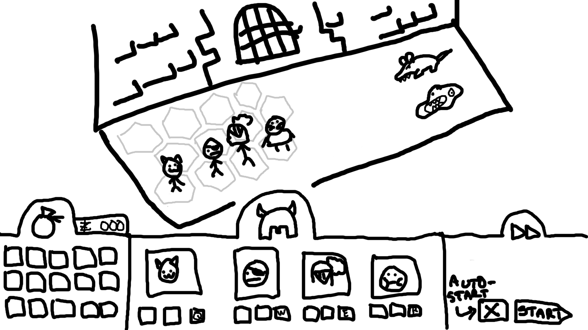
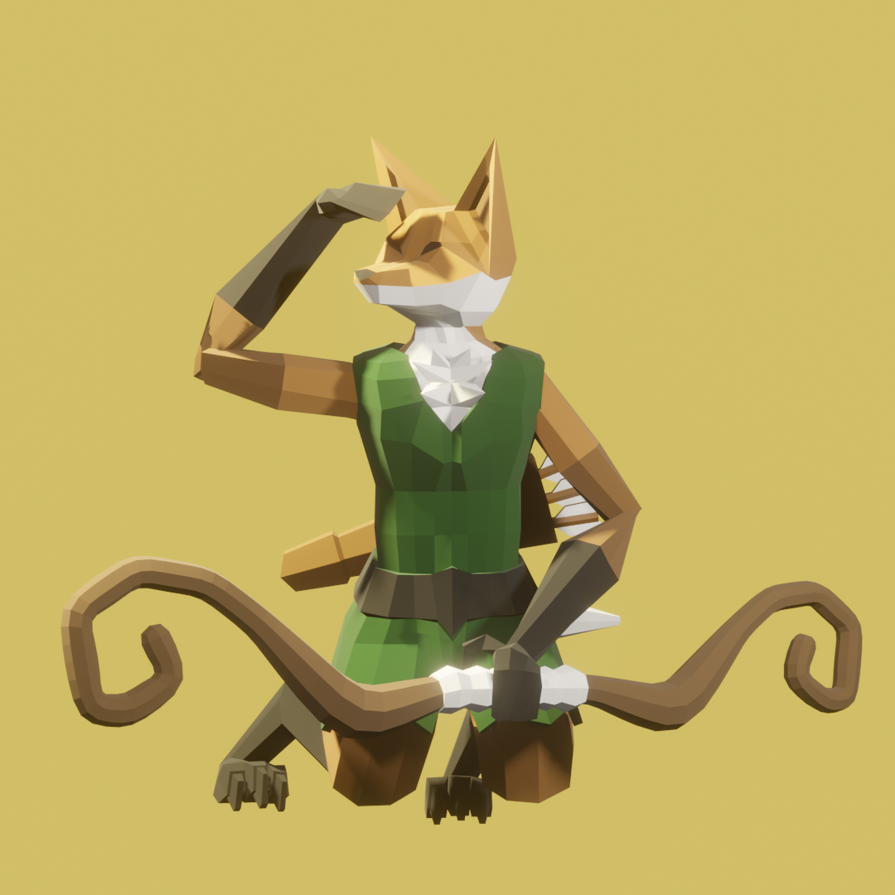
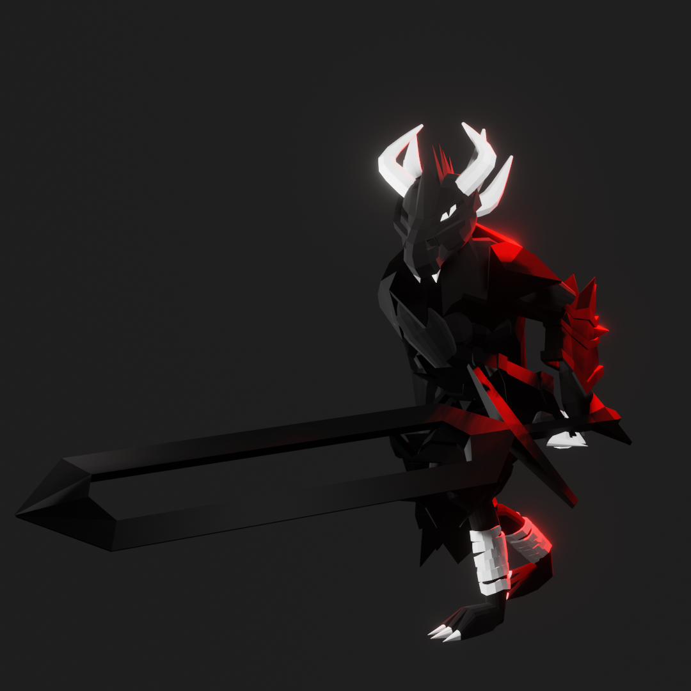
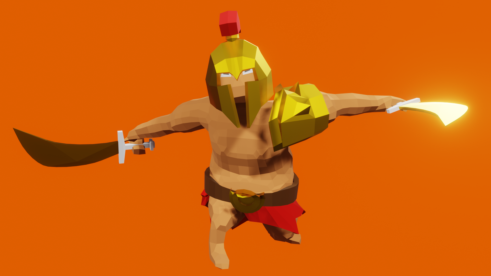
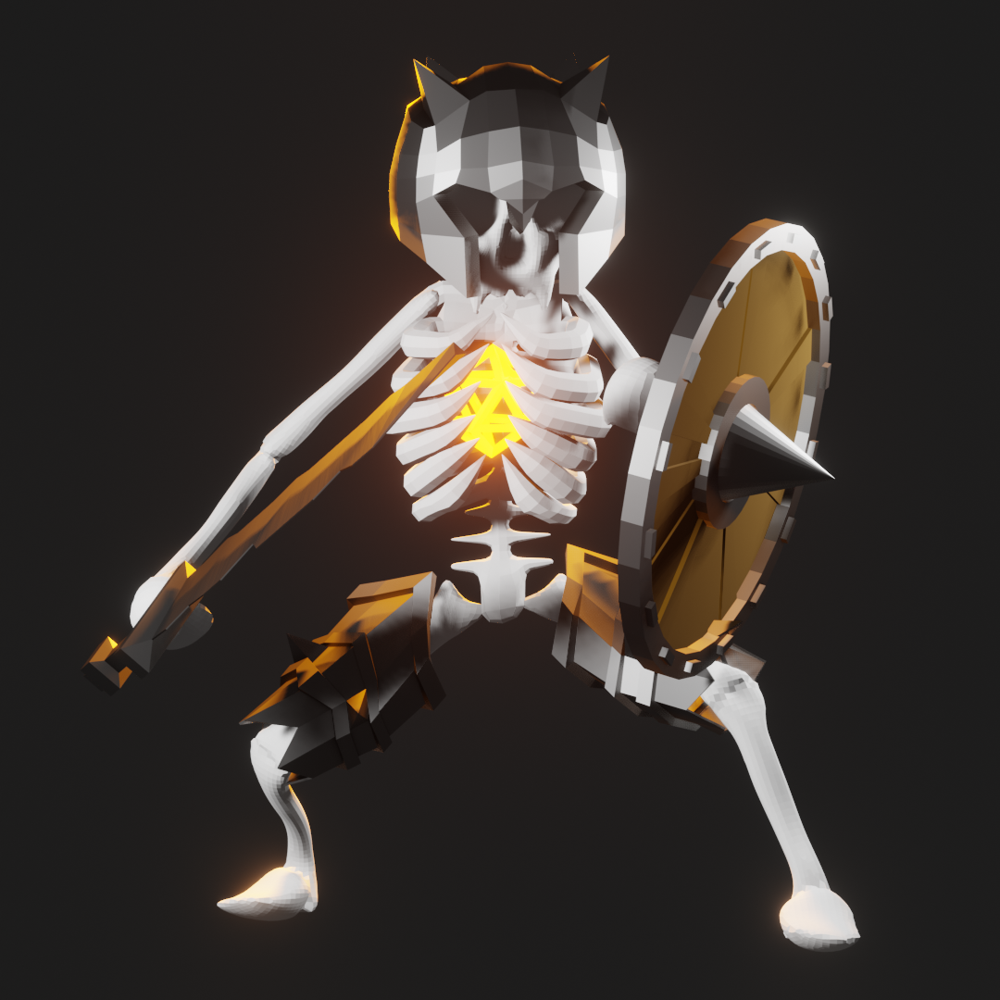
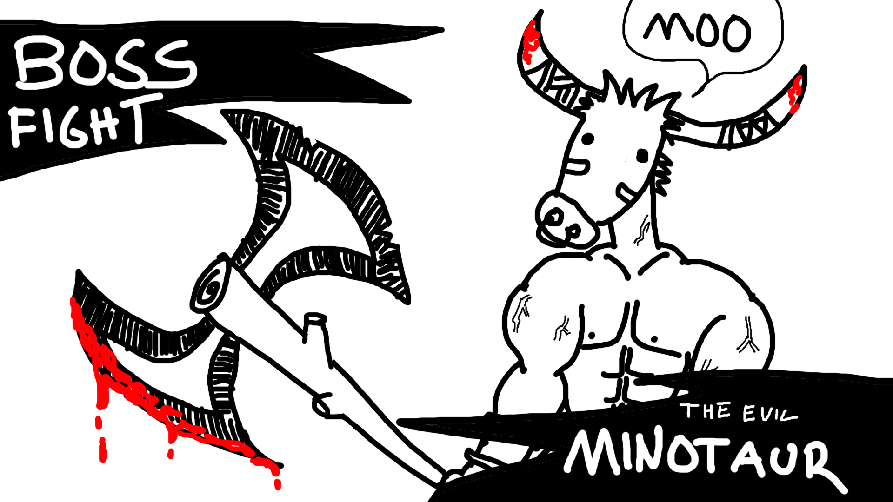

# Game Design Document

# Hypogeum

**Keywords:** Auto-battle, RPG, Roguelite, Low-Poly, Tactical, Single-Player

# Game indentity

- Tactical autobattler roguelite
- Choose your preferred team at the start of the run
    - Team size 4
    - Pick from 8 gladiators
- Throught the run your figthers will gain new items and abilities
- Many fights before a boss encounter every zone
- Four zones (for now)

# Design pillars

- Replayability
- Progression
- Unforgiving, rewarding, exciting gameplay.

# Genre/Story/Mechanics Summary

- Roguelike autobattler with rpg mechanics
- There is a simplistic story
- Choose from a pool of gladiators
- Equip abilities to use during battle
- Loot exciting items and spells to power up your character

# Features

- Autobattler combat
- Meta progression between runs
    - Upgrade gladiator stats
    - Unlock new items and gladiators
- RPG elements
    - Equip items looted from enemies
    - Equip and use new powerful abilities
    - Level characters?

# World Design

## Setting

The game takes place in alternate history fantasy Rome. This timeline is filled with magic, magical creatures, different kinds of dangerous beasts and powerful gods. 

The Gladiators you command have been wrongfully prisoned by the evil Emperor residing in his mighty palace. Your task is to fight your way to the palace and claim your freedom!

## Subsettings

The game is divided to **four levels**:

- 1. Dungeon
- 2. City
- 3. Palace
- 4. Mount Olympus

Each level will feature a new landscape and multiple groups of different enemies.

# Level Designs

Level design will be simple. Each level will feature multiple "rooms" with a floor and a back wall. The gladiators can be placed on designated area in the room. The gladiators will proceed on to the next room after the defeating all enemies in the current room. 

## Level 1 - Dungeon

Below is a concept for level generation of the First Level.

### Goals

Escape the dungeon and reach the city streets.

### Obstacles

Other gladiators, guards, slimes, giant rats, skeletons

### Tactics
Specific tactics won't be needed to clear the first level. The level is mostly designed to teach the player the game's mechanics. 

### Expectation
The first level should be rather easy to clear. Even then, the player is still expected to equip the items and spells they gain as drops. Not doing so might result in the player dying.  

### Learned Mechanics
Player learns the basic mechanics of the game:
- Placing gladiators
- Equipping items
- Starting the battle
- Using the spells

<!---
## City

### Goals

Reach the palace

### Obstacles

Guards, the roman legion

### Tactics

### Expectation

### Learned Mechanics

## Palace

### Goals

Kill emperor

### Obstacles

emperors guard

### Tactics

### Expectation

### Learned Mechanics

## Mount Olympus

### Goals

Kill god(s)

### Obstacles

various mythological creatures, servants

### Tactics

### Expectation

### Learned Mechanics
--->

# Visual Design

The game will use high-contrast vibrant color scheme, with low-polyish graphics. Low-poly will most likely be fastest, while also being the most visually pleasing option the project will have time to implement. Although the objects will be low poly, the goal is to make all the objects and levels distinguishable, so a player can actually tell what the objects are supposed to represent in real life. None of the objects will have any kind of complicated shading.

No special artistic effects will be applied. Some subtle bloom from the sun and lights.

# Music / Sound Design

## Sound Palette / instrumentation

Music design will be a big obstacle to tackle. The game will probably have to do with some free/cheap music packs, with fast, up-beat, EPIC soundtracks, that represent the game's world. Some deep digging will have to be done, to find fitting tracks.
It’d be extremely boring, if each level had the exact same background music. A new track for each level would obviously be preferable.

Royalty free sound assets will most likely be used for the sound fx. Sound effects include basic battle sounds like sword clashes, flying arrows and spellcasting sounds.

# Required Assets

## Visual

1. Models
    - Characters
        - Gladiators
            - 4 gladiator models at the very least
        - Enemies
            - 4 different enemy models at the very least
2. Animations
    - Player
        - Idle
        - Walk
        - Attack
        - Death
    - Enemy
        - Idle
        - Walking
        - Attack
        - Death
3. Icons
    - Gladiators
    - Items

## Audio
1. Audio assets
    - Battle sounds
        - Sword clash
        - Blunt weapon smash
        - Bow/Arrow sounds
        - Magical sounds (Multiple different ones)
        - Death sounds
    - Music
        - One epic battle track at the very least
        - Different song for the menu

# Interface

- Players can control the game just with the mouse if they want.
- Spells can also be cast with quickbinds from keyboard

Here's a rough sketch what the basic user interface might look like:

# Art style

Low poly, high contrast 3D models created in Blender. Below are some character renders.

Here are a couple item icon renders:

The boss fights might feature a boss splash screen. Below is an early sketch for the first level boss.

# Development Roadmap

To be updated.
